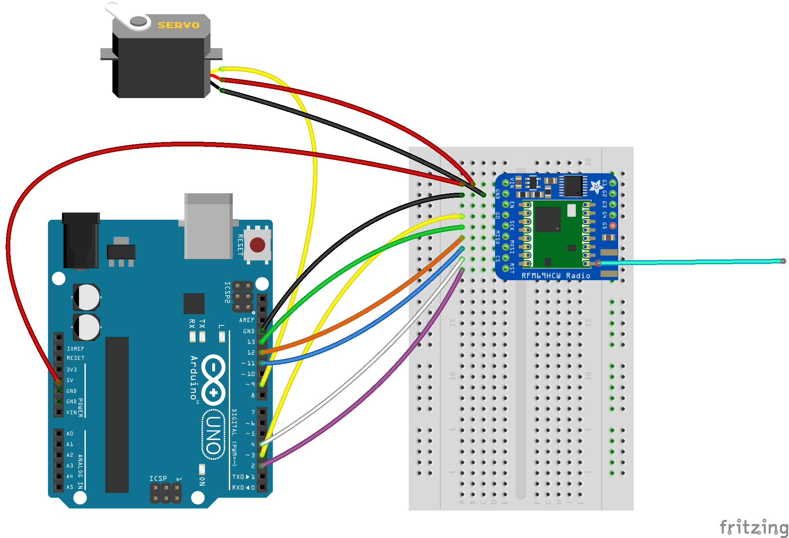

# Linking Arduinos with RFM69HCW Radio Modules

In this project we will be linking 2 Arduinos with RFM69HCW radio modules, which provide
a low-bitrate connection at ranges of up to 500M with simple wire antennas.  One Arduino
will use a potentiometer as an input device and transmit a value corresponding to the 
potentiometer's position, which will then be used to control a servo on the receiving
Arduino.  As we are just transmitting an integer value, this project can be easily adapted
to a variety of input and output devices, such as a temperature sensor sending a value to
a remote display on the receiver.

### Parts List

- 2x Arduino UNO
- 2x Adafruit RFM69HCW Transceiver Radio (Adafruit part number 3070)
- 2x solderless breadboard (recommended)
- 1x 10K potentiometer
- 1x hobby microservo
- jumper wires

If your radio module has not had headers and an antenna attached to it, you will also
need a soldering iron and solder.


### Setup
To begin, please refer to Adafruit's learning guide for the RFM69HCW module available [here](https://learn.adafruit.com/adafruit-rfm69hcw-and-rfm96-rfm95-rfm98-lora-packet-padio-breakouts/assembly).
This guide will cover assembly of the radio modules, and installation of the Arduino
libraries used to drive them (RadioHead).  NOTE: both the RadioHead and servo libraries 
make use of hardware timers on the Arduino, so it will be necessary to change a file in
the RadioHead library to tell it to use the second timer on the Arduino.  To do this, search
for the file RH_ASK.h and add the line
```
#define RH_ASK_ARDUINO_USE_TIMER2
```

### The Project
Once you have the radios setup and tested, you can proceed to the project.  Wire up the 2
Arduinos as shown below, one as a transmitter and one as a reciever.  The wiring is mostly
the same for both projects, differing only in the potentiometer and servo wiring.
###Transmitter

###Reciever


Once you've wired up the boards, load ITM-receiver.ino on the receiver board, and ITM-transmitter.ino
on the transmitter board.  Once loaded, the servo should now track the position of the 
transmitter's potentiometer.  Using the Serial Monitor functioon in the Arduino IDE, you can see the value
being sent or received by the Arduinos for debugging purposes.